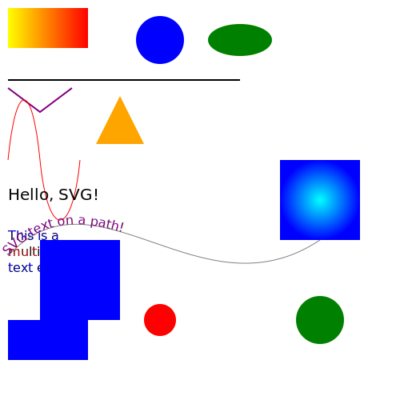

# Html-Css-Notes

Created with CodeSandbox

## Overview
This repository contains various HTML, CSS, and JavaScript files demonstrating different web development techniques.



## HTML Examples
- [CSS Layout and Effects](public/beautiful.html)
- [Comprehensive HTML Elements](public/cheatsheet.html)
- [Clock Latch](public/clock.html)
- [Structured HTML Example](public/layout.html)
- [Logic Gate Simulator (Pure CSS)](public/逻辑门模拟器 (纯CSS实现).html)

## CSS Examples
- [Benchmarking Flexbox, Grid, and Animations](public/benchmark.css)

## React Components
- [Box Component](src/components/box.jsx)

## Html

```html

<!DOCTYPE html>
<html lang="en">
<head>
  <meta charset="UTF-8">
  <meta name="viewport" content="width=device-width, initial-scale=1.0">
  <title>Comprehensive HTML Elements</title>
  <link rel="stylesheet" href="styles.css"> <!-- Link to your CSS file -->
</head>
<body>
  <!-- Structural Elements -->
  <header>
    <h1>Welcome to My Website</h1>
    <p>Explore the various HTML elements!</p>
  </header>

  <nav>
    <ul>
      <li><a href="#section1">Section 1</a></li>
      <li><a href="#section2">Section 2</a></li>
      <li><a href="#section3">Section 3</a></li>
    </ul>
  </nav>

  <main>
    <section id="section1">
      <h2>Section 1</h2>
      <p>This section demonstrates <strong>text formatting</strong>, <em>emphasis</em>, and other inline elements like <code>&lt;code&gt;</code>.</p>
      <blockquote>"This is a blockquote for quoting text."</blockquote>
      <pre>
function example() {
  console.log("This is preformatted text.");
}
      </pre>
    </section>

    <section id="section2">
      <h2>Section 2</h2>
      <article>
        <h3>Article 1</h3>
        <p>This is an independent content piece like a blog post.</p>
      </article>
      <article>
        <h3>Article 2</h3>
        <p>Another article for showcasing independent sections.</p>
      </article>
    </section>

    <section id="section3">
      <h2>Section 3</h2>
      <form>
        <fieldset>
          <legend>Sample Form</legend>
          <label for="name">Name:</label>
          <input type="text" id="name" name="name" required>

          <label for="email">Email:</label>
          <input type="email" id="email" name="email">

          <label for="message">Message:</label>
          <textarea id="message" name="message"></textarea>

          <label>
            <input type="checkbox" id="subscribe" name="subscribe">
            Subscribe to newsletter
          </label>

          <button type="submit">Submit</button>
        </fieldset>
      </form>
    </section>
  </main>

  <aside>
    <h3>Sidebar</h3>
    <p>Additional information or related links can go here.</p>
  </aside>

  <footer>
    <p>&copy; 2024 My Website. All rights reserved.</p>
  </footer>

  <!-- Media Elements -->
  <section>
    <h2>Media Elements</h2>
    <figure>
      
      <figcaption>Example image caption</figcaption>
    </figure>

    <video controls>
      <source src="example.mp4" type="video/mp4">
      Your browser does not support the video tag.
    </video>

    <audio controls>
      <source src="example.mp3" type="audio/mp3">
      Your browser does not support the audio tag.
    </audio>
  </section>

  <!-- List Example -->
  <section>
    <h2>List Example</h2>
    <ul>
      <li>Unordered List Item 1</li>
      <li>Unordered List Item 2</li>
    </ul>
    <ol>
      <li>Ordered List Item 1</li>
      <li>Ordered List Item 2</li>
    </ol>
  </section>

  <!-- Interactive Elements -->
  <section>
    <h2>Interactive Elements</h2>
    <details>
      <summary>More Info</summary>
      <p>This is additional information hidden by default.</p>
    </details>
    <progress value="70" max="100">70%</progress>
    <meter value="0.7">70%</meter>
  </section>
</body>
</html>

```

## CSS

```css
/* Flexbox Example */
.flex-container {
  display: flex;
  flex-direction: row;
  justify-content: space-between;
  align-items: center;
  padding: 10px;
}
.flex-item {
  background-color: #f4f4f4;
  margin: 10px;
  padding: 20px;
  border: 1px solid #ddd;
}

/* Grid Example */
.grid-container {
  display: grid;
  grid-template-columns: repeat(auto-fit, minmax(200px, 1fr));
  gap: 20px;
}
.grid-item {
  background-color: #e0e0e0;
  padding: 20px;
  border: 1px solid #ccc;
}

/* Media Queries */
@media (max-width: 768px) {
  .flex-container {
    flex-direction: column;
  }
  .grid-container {
    grid-template-columns: 1fr;
  }
}

/* Animations */
@keyframes fadeIn {
  from { opacity: 0; }
  to { opacity: 1; }
}
.animate-fade-in {
  animation: fadeIn 2s ease-in-out;
}

/* Word Wrap */
.word-wrap {
  word-wrap: break-word;
  overflow-wrap: break-word;
  white-space: normal;
}

/* Masonry Layout */
.masonry {
  column-count: 3;
  column-gap: 20px;
}
.masonry-item {
  display: inline-block;
  background: #f9f9f9;
  margin-bottom: 20px;
  padding: 10px;
  break-inside: avoid;
}

/* Parallax Effect */
.parallax {
  background-image: url('your-image.jpg');
  background-attachment: fixed;
  background-size: cover;
  background-position: center;
  height: 500px;
}

/* Repeated Word Wrap Example */
.repeat-word-wrap {
  white-space: normal;
  overflow-wrap: break-word;
}

/* HTML Structure */
/* Apply these styles to respective HTML elements */
header {
  background-color: #333;
  color: white;
  padding: 10px;
  text-align: center;
}
nav {
  background-color: #444;
  color: white;
  padding: 10px;
  text-align: center;
}
main {
  padding: 20px;
}
aside {
  background-color: #f9f9f9;
  padding: 10px;
  border: 1px solid #ddd;
}
footer {
  background-color: #222;
  color: white;
  padding: 10px;
  text-align: center;
}

/* Nth-Child Example */
.nth-child-example div:nth-child(2) {
  background-color: #ffcccb;
}

/* Button Hover */
button:hover {
  background-color: #555;
  color: white;
}

/* Select All Children */
.parent > * {
  margin: 10px;
  padding: 10px;
  border: 1px solid #ccc;
}

/* Checkbox Checked with Sibling Label */
input[type="checkbox"]:checked + label {
  color: green;
  font-weight: bold;
}

/* General Reset */
* {
  margin: 0;
  padding: 0;
  box-sizing: border-box;
}

/* CSS Functions */

/* color manipulation functions */
.example-color {
  background-color: rgba(255, 0, 0, 0.5); /* Transparency */
  border: 1px solid hsl(120, 50%, 50%); /* HSL Color */
  color: hsla(240, 100%, 50%, 0.7); /* HSLA Color */
}

/* calc function */
.example-calc {
  width: calc(100% - 20px);
  padding: 10px;
  font-size: calc(16px + 1vw); /* Responsive font size */
}

/* clamp function */
.example-clamp {
  font-size: clamp(12px, 2vw, 24px);
}

/* attr function */
.example-attr::after {
  content: attr(data-title);
  color: blue;
}

/* transform functions */
.example-transform {
  transform: rotate(45deg) scale(1.5) translateX(50px);
}

/* gradient functions */
.example-gradient {
  background: linear-gradient(90deg, red, blue);
  background: radial-gradient(circle, red, yellow, green);
}

/* repeating gradient functions */
.example-repeating-gradient {
  background: repeating-linear-gradient(45deg, red, yellow 10px, blue 20px);
}

/* url function */
.example-url {
  background: url('https://example.com/image.jpg') no-repeat center/cover;
}

/* var function */
:root {
  --primary-color: #3498db;
  --secondary-color: #2ecc71;
}
.example-var {
  background-color: var(--primary-color);
  color: var(--secondary-color);
}

/* filter functions */
.example-filter {
  filter: brightness(150%) contrast(120%) blur(5px);
}

/* cubic-bezier function */
.example-cubic-bezier {
  animation: bounce 2s cubic-bezier(0.25, 1, 0.5, 1) infinite;
}

@keyframes bounce {
  0%, 100% {
    transform: translateY(0);
  }
  50% {
    transform: translateY(-50px);
  }
}

/* clip-path function */
.example-clip-path {
  clip-path: polygon(50% 0%, 100% 50%, 50% 100%, 0% 50%);
}

/* conic-gradient */
.example-conic-gradient {
  background: conic-gradient(from 0deg, red, yellow, green, blue, red);
}

/* repeating-conic-gradient */
.example-repeating-conic-gradient {
  background: repeating-conic-gradient(from 0deg, red 10deg, yellow 20deg);
}

/* counter function */
ol {
  counter-reset: section;
}
.example-counter li {
  counter-increment: section;
  content: counter(section) ". ";
}

/* path function for SVG */
.example-path {
  d: path("M10 80 C 40 10, 65 10, 95 80 S 150 150, 180 80");
}

/* inset function */
.example-inset {
  box-shadow: inset 0 4px 10px rgba(0, 0, 0, 0.5);
}

/* min, max, and clamp functions */
.example-dimensions {
  width: min(50vw, 500px);
  height: max(300px, 30vh);
}

/* shape-outside function */
.example-shape {
  float: left;
  shape-outside: circle(50% at 50% 50%);
  width: 100px;
  height: 100px;
}

/* Grid layout using CSS functions */
.example-grid {
  display: grid;
  grid-template-columns: repeat(auto-fit, minmax(100px, 1fr));
}

/* Flexbox with CSS functions */
.example-flex {
  display: flex;
  justify-content: space-around;
  align-items: center;
  gap: clamp(10px, 2vw, 20px);
}

/* CSS Layout Techniques */

/* 1. Block Layout */
.block-layout {
  display: block;
  margin: 10px;
  padding: 10px;
  background-color: #f4f4f4;
}

/* 2. Inline Layout */
.inline-layout {
  display: inline;
  margin: 10px;
  padding: 5px;
  background-color: #e4e4e4;
}

/* 3. Inline-Block Layout */
.inline-block-layout {
  display: inline-block;
  width: 100px;
  height: 50px;
  margin: 5px;
  padding: 10px;
  background-color: #d4d4d4;
}

/* 4. Flexbox Layout */
.flex-container {
  display: flex;
  flex-wrap: wrap;
  justify-content: space-between;
  align-items: center;
  gap: 10px;
  padding: 10px;
  background-color: #c4c4c4;
}
.flex-item {
  flex: 1 1 calc(25% - 10px);
  background-color: #b4b4b4;
  text-align: center;
  padding: 10px;
}

/* 5. Grid Layout */
.grid-container {
  display: grid;
  grid-template-columns: repeat(auto-fit, minmax(100px, 1fr));
  gap: 10px;
  padding: 10px;
  background-color: #a4a4a4;
}
.grid-item {
  background-color: #949494;
  text-align: center;
  padding: 10px;
}

/* 6. Positioning Layout */
.positioning-container {
  position: relative;
  width: 300px;
  height: 200px;
  background-color: #848484;
  margin: 20px auto;
}
.positioning-item {
  position: absolute;
  background-color: #747474;
  padding: 10px;
}
.positioning-item.top-left {
  top: 10px;
  left: 10px;
}
.positioning-item.bottom-right {
  bottom: 10px;
  right: 10px;
}

/* 7. Multi-Column Layout */
.multi-column {
  column-count: 3;
  column-gap: 20px;
  padding: 10px;
  background-color: #646464;
}
.multi-column p {
  margin: 0 0 10px;
}

/* 8. Float Layout */
.float-container {
  width: 100%;
  background-color: #545454;
  overflow: hidden;
}
.float-item {
  float: left;
  width: calc(50% - 20px);
  margin: 10px;
  background-color: #444444;
  padding: 10px;
  box-sizing: border-box;
}

/* 9. Table Layout */
.table-container {
  display: table;
  width: 100%;
  background-color: #343434;
  border-spacing: 10px;
}
.table-row {
  display: table-row;
}
.table-cell {
  display: table-cell;
  padding: 10px;
  background-color: #242424;
  color: white;
  text-align: center;
}

/* 10. Responsive Layout */
@media (max-width: 768px) {
  .responsive-item {
    flex: 1 1 100%;
  }
  .grid-container {
    grid-template-columns: 1fr;
  }
}

/* Utilities for Layout Demonstration */
body {
  font-family: Arial, sans-serif;
  line-height: 1.5;
  margin: 0;
  padding: 0;
}
h1 {
  text-align: center;
  margin: 20px 0;
}
.container {
  max-width: 1200px;
  margin: 0 auto;
  padding: 20px;
}
```

## SVG
```svg
 <svg width="500" height="500" xmlns="http://www.w3.org/2000/svg">
    <!-- Structural Elements -->
    <defs>
      <linearGradient id="linearGradient1" x1="0%" y1="0%" x2="100%" y2="0%">
        <stop offset="0%" style="stop-color:rgb(255,255,0);stop-opacity:1" />
        <stop offset="100%" style="stop-color:rgb(255,0,0);stop-opacity:1" />
      </linearGradient>
      <symbol id="starSymbol" viewBox="0 0 100 100">
        <polygon points="50,15 61,35 85,35 66,50 75,72 50,58 25,72 34,50 15,35 39,35" fill="gold" />
      </symbol>
    </defs>

    <!-- Use -->
    <use href="#starSymbol" x="20" y="20" width="50" height="50" />

    <!-- Shape Elements -->
    <rect x="10" y="10" width="100" height="50" fill="url(#linearGradient1)" />
    <circle cx="200" cy="50" r="30" fill="blue">
      <animate attributeName="r" from="10" to="30" dur="1s" repeatCount="indefinite" />
    </circle>
    <ellipse cx="300" cy="50" rx="40" ry="20" fill="green" />
    <line x1="10" y1="100" x2="300" y2="100" stroke="black" stroke-width="2" />
    <polyline points="10,110 50,140 90,110" fill="none" stroke="purple" stroke-width="2" />
    <polygon points="150,120 180,180 120,180" fill="orange" />

    <!-- Path -->
    <path d="M10 200 C 20 100, 40 100, 50 200 S 90 300, 100 200" fill="none" stroke="red" />

    <!-- Text Elements -->
    <text x="10" y="250" font-size="20" fill="black">Hello, SVG!</text>
    <text x="10" y="280" font-size="16" fill="blue">
      <tspan x="10" dy="20">This is a </tspan>
      <tspan x="10" dy="20" fill="red">multi-line</tspan>
      <tspan x="10" dy="20">text example.</tspan>
    </text>

    <!-- Text Path -->
    <path id="textPath" d="M10 320 C 120 200, 250 400, 400 300" fill="none" stroke="gray" />
    <text>
      <textPath href="#textPath" fill="purple">SVG text on a path!</textPath>
    </text>

    <!-- Gradient and Pattern -->
    <radialGradient id="radialGradient1" cx="50%" cy="50%" r="50%" fx="50%" fy="50%">
      <stop offset="0%" style="stop-color:rgb(0,255,255);stop-opacity:1" />
      <stop offset="100%" style="stop-color:rgb(0,0,255);stop-opacity:1" />
    </radialGradient>
    <rect x="350" y="200" width="100" height="100" fill="url(#radialGradient1)" />

    <!-- Animation Elements -->
    <rect x="10" y="400" width="100" height="50" fill="blue">
      <animate attributeName="x" from="10" to="300" dur="3s" repeatCount="indefinite" />
    </rect>
    
    <!-- Filter Elements -->
    <filter id="blurFilter">
      <feGaussianBlur in="SourceGraphic" stdDeviation="5" />
    </filter>
    <circle cx="400" cy="400" r="30" fill="green" filter="url(#blurFilter)" />

    <!-- Clip and Mask Elements -->
    <clipPath id="clip1">
      <circle cx="200" cy="400" r="20" />
    </clipPath>
    <rect x="180" y="380" width="100" height="50" fill="red" clip-path="url(#clip1)" />

    <mask id="mask1">
      <rect x="0" y="0" width="100" height="100" fill="white" />
      <circle cx="50" cy="50" r="30" fill="black" />
    </mask>
    <rect x="50" y="300" width="100" height="100" fill="blue" mask="url(#mask1)" />

    <!-- Metadata and Description -->
    <title>Comprehensive SVG Example</title>
    <desc>This SVG demonstrates all common SVG elements in use.</desc>
  </svg>

```

## What Else

Here are additional technologies and tools you can explore alongside HTML, CSS, and SVG, apart from JavaScript:

### Front-End Development Enhancements:
1. **Web Components** - Standardized approach to build reusable UI components.
2. **TypeScript** - A typed superset of JavaScript that compiles to plain JavaScript.
3. **Sass/SCSS or LESS** - Preprocessors for CSS to add features like variables, nesting, and mixins.
4. **Bootstrap or Tailwind CSS** - CSS frameworks for rapid UI development.
5. **Canvas API** - For creating and manipulating 2D graphics.
6. **WebAssembly** - For running compiled code (like C++/Rust) in the browser alongside JavaScript.
7. **ARIA (Accessible Rich Internet Applications)** - Accessibility guidelines for web components.

### Animation and Graphics:
1. **GSAP (GreenSock Animation Platform)** - Advanced animations for DOM and SVG.
2. **WebGL/Three.js** - For creating 3D graphics and animations.
3. **Lottie** - For integrating high-quality animations exported from Adobe After Effects as JSON.

### Server and APIs:
1. **GraphQL** - A flexible query language for APIs.
2. **WebSockets** - For real-time bidirectional communication.
3. **Service Workers** - For building Progressive Web Apps (PWAs) with offline capabilities.

### Performance Optimization:
1. **Lazy Loading** - Techniques for delaying resource loading until needed.
2. **Intersection Observer API** - For efficiently monitoring element visibility.
3. **Critical CSS** - Extracting and inlining above-the-fold CSS.

### Testing and Debugging:
1. **Chrome DevTools/Firefox Developer Tools** - For debugging and optimizing web applications.
2. **Lighthouse** - For performance, accessibility, and SEO audits.
3. **Postman/Insomnia** - For API testing and debugging.

### Frameworks and Libraries (Beyond JS):
1. **WebAssembly** - Run high-performance code in the browser.
2. **Elm** - A functional language for reliable front-end development.
3. **Svelte** - A compiler for building fast, lightweight applications.
4. **Vue.js, Angular, React** - Comprehensive front-end frameworks.

### Design and Prototyping Tools:
1. **Figma, Adobe XD, or Sketch** - For UI/UX design and prototyping.
2. **Inkscape** - A free vector graphics editor for SVG creation.

### Accessibility and Internationalization:
1. **WCAG Guidelines** - Accessibility standards.
2. **i18next** - For internationalization and localization.

### Other Standards and Technologies:
1. **HTML Web APIs** - Built-in browser APIs like Geolocation, File API, and IndexedDB.
2. **Polyfills** - Libraries to add functionality to older browsers.
3. **AMP (Accelerated Mobile Pages)** - For faster mobile page loading.
4. **Microdata or RDFa** - For semantic web and structured data.

Each of these complements HTML, CSS, and SVG in creating dynamic, accessible, and high-performance web applications.
